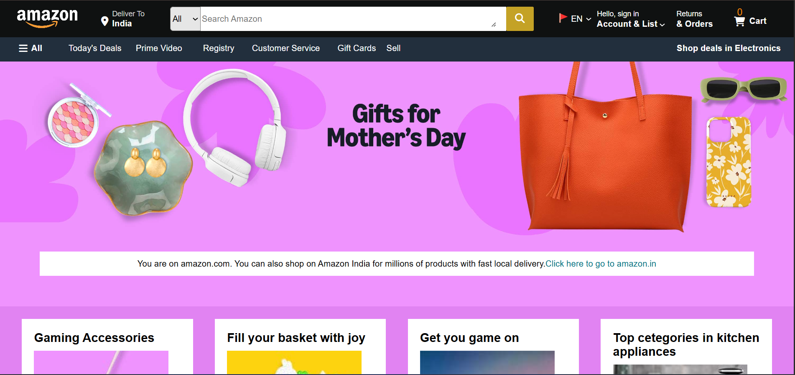

# Amazon Clone 🛒

This is a simple responsive clone of Amazon's homepage built using only **HTML** and **CSS**.  
It is part of my learning journey to practice layout design, responsiveness, and basic web UI building.

## 🔧 Tech Used

- HTML
- CSS

## 📁 Folder Structure

- `index.html` - Main file

- `style.css` - Custom styling
-  others Contains all product and logo images

## 📸 Preview

## 🙌 Made with dedication by Vishal 
